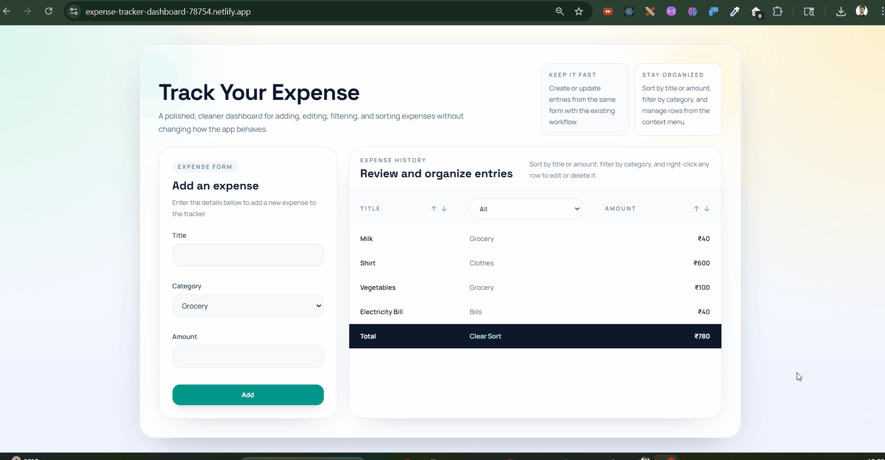
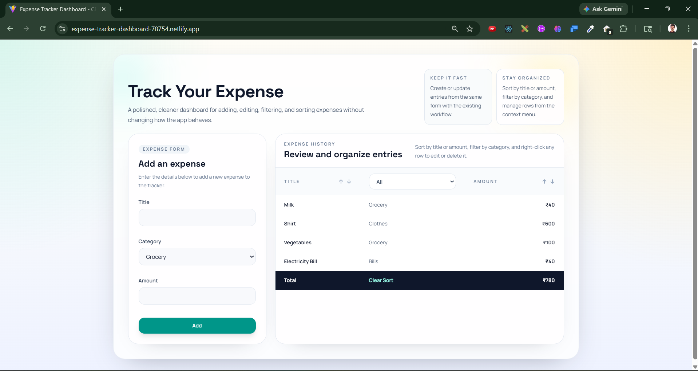
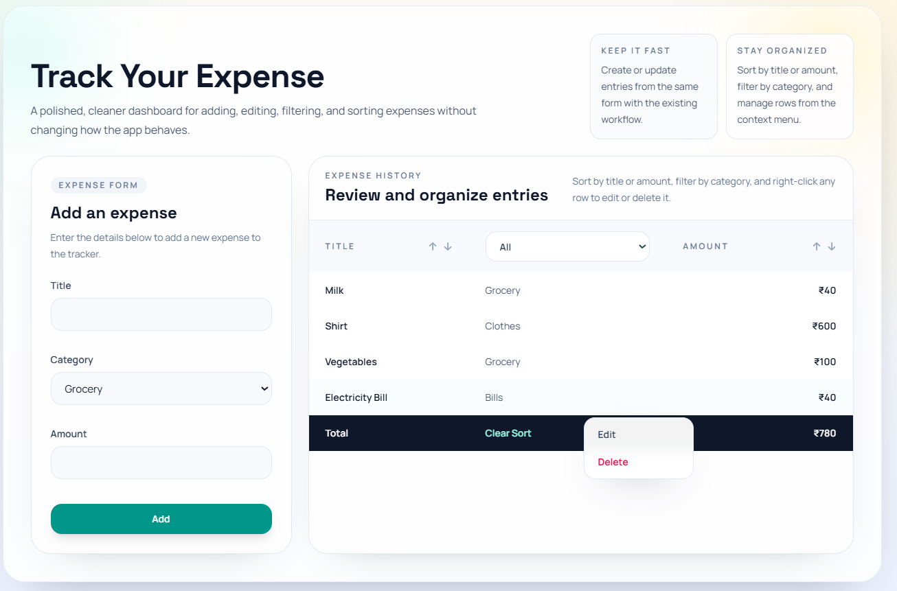
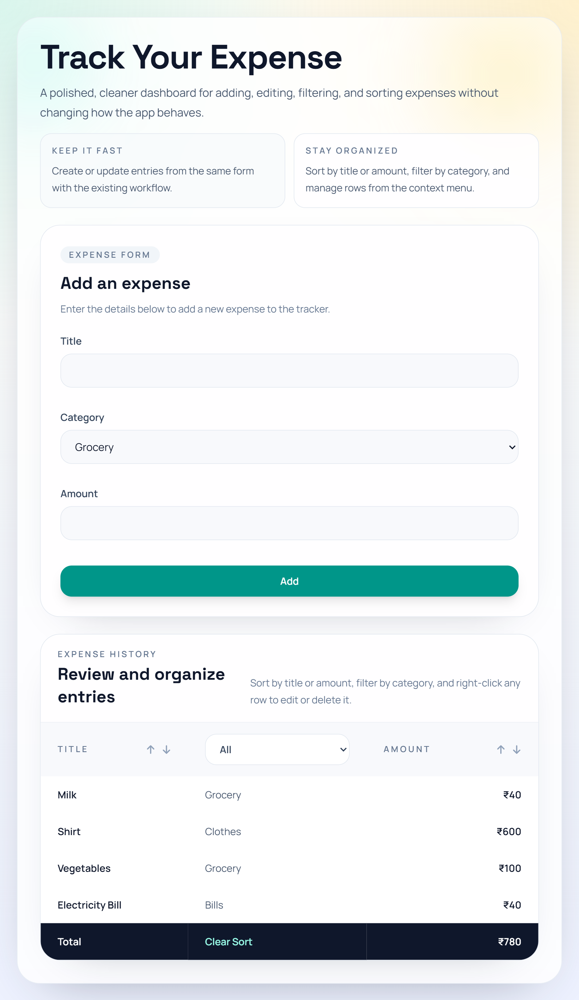

# Expense Tracker Dashboard

A polished CRUD-based expense tracker built with React, Vite, and Tailwind CSS. The app lets users add, edit, delete, filter, and sort expense entries while keeping data saved in the browser with `localStorage`.


🔗 **Live Demo:** https://expense-tracker-dashboard-78754.netlify.app/

---

## Overview

This project is a frontend-only expense management application designed to demonstrate practical React form handling, reusable components, custom hooks, and clean state management.

On first launch, the app loads with sample expense data. From there, users can manage entries through a modern dashboard interface without needing any backend or database setup.

---

## 🎥 Live Preview

<p align="center">
  
</p>

---

## Features

- Add new expenses with title, category, and amount.
- Edit existing rows using the same form workflow.
- Delete entries from a custom right-click context menu.
- Filter expenses by category.
- Sort expenses by title or amount in ascending and descending order.
- View a running total for the currently displayed expense list.
- Validate form input before saving data.
- Persist expense data, form state, filter state, and edit state in `localStorage`.
- Use a responsive layout that works well across desktop and smaller screens.

---

## Tech Stack

- React 18
- Vite
- Tailwind CSS 4
- JavaScript (ES Modules)
- Browser `localStorage` for persistence

---

## How It Works

### Expense form

The form supports both create and update actions:

- When no row is being edited, submitting the form creates a new expense.
- When a row is selected for editing, the form is prefilled and the same submit button updates that entry.
- Validation checks required fields, minimum title length, and valid numeric amount input.

### Expense table

The table is the main review area for stored entries:

- Category filtering narrows the visible list.
- Sorting controls reorder entries by title or amount.
- A running total updates based on the currently filtered and sorted records.
- Right-clicking a row opens a context menu with edit and delete actions.

### Persistence

The application stores data in `localStorage`, which means:

- Expenses remain available after page refresh.
- The current form state can survive a refresh.
- The selected filter and editing state are also stored locally.
- No backend service is required.

---

## Project Structure

```text
.
|-- public/
|-- src/
|   |-- assets/
|   |-- components/
|   |   |-- ContextMenu.jsx
|   |   |-- ExpenseForm.jsx
|   |   |-- ExpenseTable.jsx
|   |   |-- Input.jsx
|   |   `-- Select.jsx
|   |-- hooks/
|   |   |-- useFilter.js
|   |   `-- useLocalStorage.js
|   |-- App.jsx
|   |-- expenseData.js
|   |-- index.css
|   `-- main.jsx
|-- index.html
|-- package.json
`-- vite.config.js
```

---

## Getting Started

### Prerequisites

Make sure you have the following installed:

- Node.js
- npm

### Installation

```bash
npm install
```

### Start the development server

```bash
npm run dev
```

Then open the local URL shown in your terminal.

### Build for production

```bash
npm run build
```

### Preview the production build

```bash
npm run preview
```

---

## Available Scripts

- `npm run dev` - starts the Vite development server
- `npm run build` - creates the production build in `dist/`
- `npm run preview` - previews the production build locally
- `npm run lint` - runs ESLint on the `src` directory after adding an ESLint configuration file

---

## Why This Project Is Useful

This repository is a solid learning reference for:

- controlled form inputs in React
- custom hooks for reusable logic
- storing application state in `localStorage`
- conditional UI for create vs. edit modes
- responsive dashboard layout with Tailwind CSS
- building CRUD behavior without a backend

---

## Possible Future Improvements

- Add search by expense title
- Add date support for each expense
- Add category management instead of hardcoded options
- Add charts and monthly summaries
- Add export to CSV or PDF
- Add automated tests
- Add a backend API and authentication

---

## Deployment

This is a static frontend application, so it can be deployed easily on platforms such as:

- GitHub Pages
- Vercel
- Netlify

---

## 📸 Screenshots

<p align="center">
  
  
</p>

<p align="center">
  
</p>

---

## License

MIT License

Copyright (c) 2026 Ashish Kumar

Permission is hereby granted, free of charge, to any person obtaining a copy
of this software and associated documentation files (the "Software"), to deal
in the Software without restriction, including without limitation the rights
to use, copy, modify, merge, publish, distribute, sublicense, and/or sell
copies of the Software, and to permit persons to whom the Software is
furnished to do so, subject to the following conditions:

The above copyright notice and this permission notice shall be included in all
copies or substantial portions of the Software.

THE SOFTWARE IS PROVIDED "AS IS", WITHOUT WARRANTY OF ANY KIND, EXPRESS OR
IMPLIED, INCLUDING BUT NOT LIMITED TO THE WARRANTIES OF MERCHANTABILITY,
FITNESS FOR A PARTICULAR PURPOSE AND NONINFRINGEMENT. IN NO EVENT SHALL THE
AUTHORS OR COPYRIGHT HOLDERS BE LIABLE FOR ANY CLAIM, DAMAGES OR OTHER
LIABILITY, WHETHER IN AN ACTION OF CONTRACT, TORT OR OTHERWISE, ARISING FROM,
OUT OF OR IN CONNECTION WITH THE SOFTWARE OR THE USE OR OTHER DEALINGS IN THE
SOFTWARE.

---

## 👨‍💻 Author

**Ashish Kumar**

📧 [ashishkumar78754@gmail.com](mailto:ashishkumar78754@gmail.com)
🔗 https://github.com/ashish78754

---

## ⭐ Show Your Support

If you like this project:

👉 Give it a ⭐ on GitHub
👉 Share it with others

---
